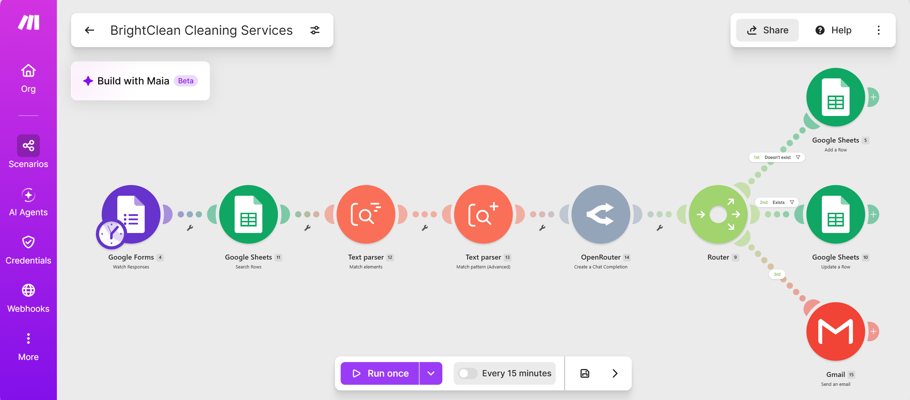

# brightclean-automated-intake-engine
# 🧹 BrightClean Cleaning Services - AI Lead Intake & Client CRM Engine

An automated lead intake, account verification, and data extraction engine built in Make.com for a service-based business. Inspired by real-world workflow architectures, this scenario automatically parses customer inquiries, checks database existence, passes enriched context through OpenRouter AI, and routes output dynamically.

---

## 📌 Problem Solved
Manual lead handling creates delays, duplicate contacts in databases, and inconsistent follow-ups. This workflow automates customer verification, extracts structured metadata (URLs, contact info, budget patterns), and performs smart database updates or additions without human intervention.

---

## 🛠️ Workflow Architecture & Tech Stack

### **Modules & Services Used:**
* **Trigger:** `Google Forms` (Captures incoming client inquiries)
* **Database Verification:** `Google Sheets (Search Rows)` (Scans existing CRM by email)
* **Data Parsing:** `Text Parser` (Regex & Pattern Matching to extract URLs and key parameters)
* **AI Processing:** `OpenRouter API` (Analyzes message sentiment, urgency, and service classification)
* **Conditional Logic:** `Router` with custom filter paths:
  * **Path 1 (Doesn't Exist):** `Google Sheets: Add a Row` (Creates a new CRM record)
  * **Path 2 (Exists):** `Google Sheets: Update a Row` (Updates existing record using mapped Row ID)
  * **Path 3 (Communication):** `Gmail` (Sends automated email confirmations/notifications)

---

## ⚙️ Key Technical Features
* **Duplicate Prevention:** Case-insensitive search checks existing records before writing data.
* **Error Prevention:** Configured with *Continue execution on empty results* across search and parsing modules to prevent execution halts.
* **Smart Data Fallback:** Maps dynamic variables to handle optional or missing form fields gracefully.

---

## 📄 How to Import & Test
1. Download the `blueprint.json` file from this repository.
2. Go to [Make.com](https://make.com) ➔ Create a new scenario.
3. Click the `...` menu at the bottom bar ➔ Select **Import Blueprint**.
4. Re-bind your Google Forms, Google Sheets, OpenRouter, and Gmail connection credentials.
